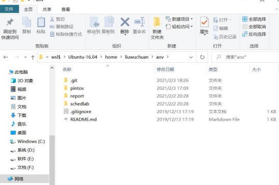
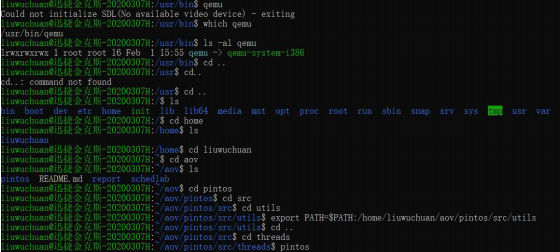
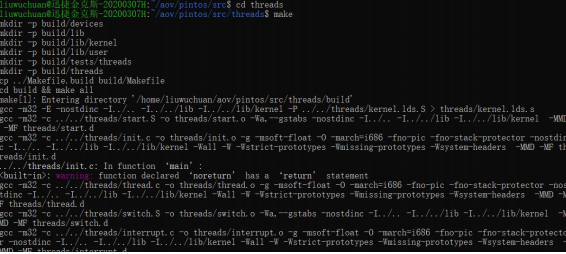
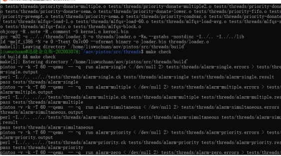
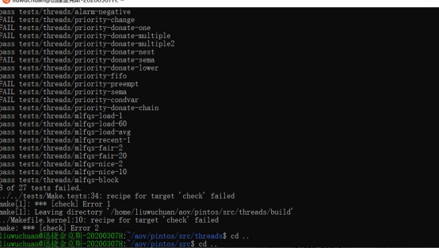
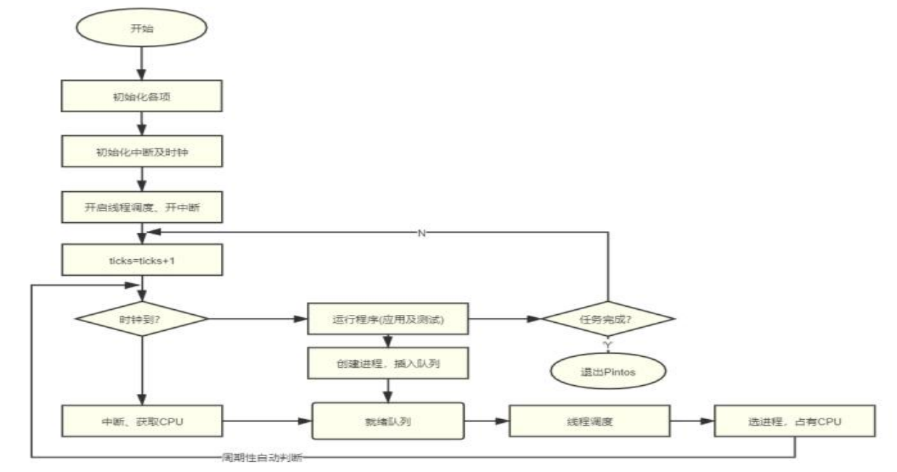
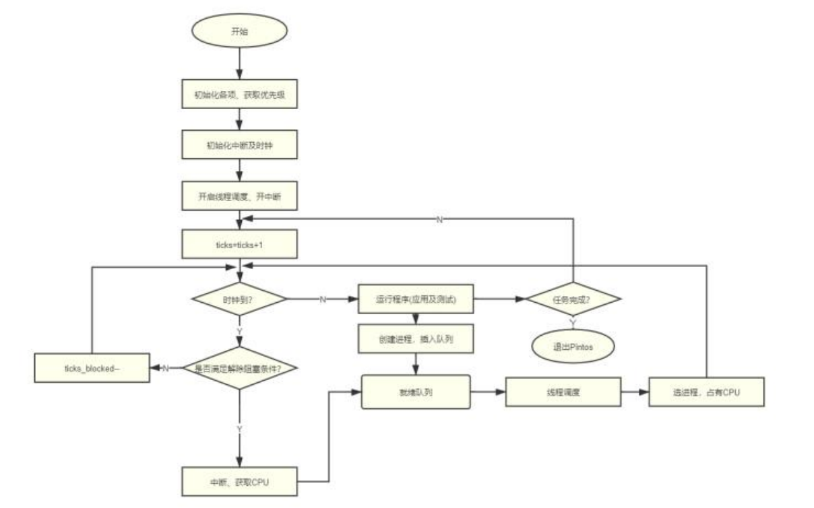
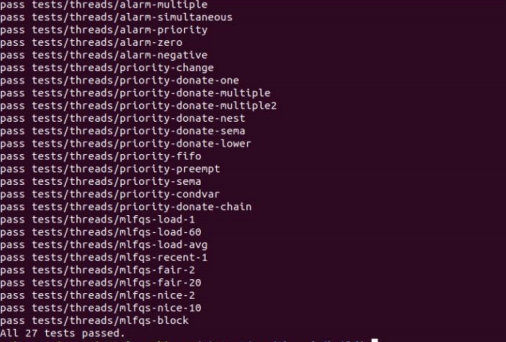

{width="3.875in" height="0.5916666666666667in"}

操作系统课程设计报告

**2020-2021**

{width="1.0763888888888888in" height="0.9875in"}

> 题 目 **[操作系统课设]{.underline}**
>
> 学 号 [201906061609]{.underline}
>
> 班 级 [软件工程1902班]{.underline}
>
> 姓 名 [吕锐]{.underline}
>
> 指导教师 [于明远]{.underline}

所在学院 [计算机学院]{.underline}

提交日期 [2022年1月11日]{.underline}

# 目录 {#目录 .TOC-Heading}

[一、实验项目介绍 [4](#一实验项目介绍)](\l)

[1.1实验要求 [4](#实验要求)](\l)

[1.2配置步骤 [4](#配置步骤)](\l)

[遇到的问题 [8](#遇到的问题)](\l)

[二、简单shell实现 [8](#二简单shell实现)](\l)

[2.1要求 [8](#要求)](\l)

[2.2 cd 和 pwd [9](#cd-和-pwd)](\l)

[2.3程序执行 [9](#程序执行)](\l)

[2.4路径解析 [9](#路径解析)](\l)

[2.5输入输出重定向 [9](#输入输出重定向)](\l)

[2.6管道 [11](#管道)](\l)

[2.7信号处理和终端控制 [11](#信号处理和终端控制)](\l)

[2.8前台和后台进程 [12](#前台和后台进程)](\l)

[三、线程管理 [14](#三线程管理)](\l)

[3.2 Alarm Clock [15](#alarm-clock)](\l)

[3.3 Priority Scheduling [17](#priority-scheduling)](\l)

[3.4 MLFQS [20](#mlfqs)](\l)

[四、用户程序 [22](#四用户程序)](\l)

[4.1要求 [22](#要求-2)](\l)

[4.2 Argument Passing [22](#argument-passing)](\l)

[4.3 System Call [24](#system-call)](\l)

[四、 总结和展望 [26](#总结和展望)](\l)

[5.1实验总结 [26](#对专业知识基本概念基本理论和典型方法的理解)](\l)

[5.2对专业知识基本概念、基本理论和典型方法的理解。
[27](#对专业知识基本概念基本理论和典型方法的理解)](\l)

[5.3怎么建立模型。 [27](#怎么建立模型)](\l)

[5.4如何利用基本原理解决复杂工程问题。
[27](#如何利用基本原理解决复杂工程问题)](\l)

[5.5具有实验方案设计的能力。 [27](#具有实验方案设计的能力)](\l)

[5.6如何对环境和社会的可持续发展。
[28](#如何对环境和社会的可持续发展)](\l)

## 一、实验项目介绍

### 1.1实验要求

完成 shell 和 pintos 的 threads，userprog 和 filesys（选做）任务。

### 1.2配置步骤

1.2.1 在Windows上安装linux虚拟机并修改源

1、做该实验需要下载windows环境下的虚拟机，在微软商店搜索Ubuntu16.04，直接下载安装即
可。

{width="1.1006944444444444in"
height="1.0590277777777777in"}

图1.2.1 ubuntu16.04

2.  下载完毕后为了安装插件方便，需要将默认的官网下载源改为国内的源，我选择的是阿里源，
    步骤如下。

    2.1.第一步： sudo vim /etc/apt/sources.list 删除里面的所有内容

    2.2.第二步:

添加以下内容：

deb http://mirrors.aliyun.com/ubuntu/ trusty main multiverse restricted
universe

deb http://mirrors.aliyun.com/ubuntu/ trusty-backports main multiverse
restricted universe

deb http://mirrors.aliyun.com/ubuntu/ trusty-proposed main multiverse
restricted universe deb http://mirrors.aliyun.com/ubuntu/
trusty-security main multiverse restricted universe

deb http://mirrors.aliyun.com/ubuntu/ trusty-updates main multiverse
restricted universe

deb-src http://mirrors.aliyun.com/ubuntu/ trusty main multiverse
restricted universe

deb-src http://mirrors.aliyun.com/ubuntu/ trusty-backports main
multiverse restricted universe

deb-src http://mirrors.aliyun.com/ubuntu/ trusty-proposed main
multiverse restricted universe

deb-src http://mirrors.aliyun.com/ubuntu/ trusty-security main
multiverse restricted universe

deb-src http://mirrors.aliyun.com/ubuntu/ trusty-updates main multiverse
restricted universe

然后保存退出

2.3第三步：sudo apt-get update，更新成功

3.  下载git 方便从gitlab中拉取库，并上传库 在git官网下载git bash

    {width="2.352777777777778in"
    height="1.0083333333333333in"}

    图1.2.1.2 git bash安装目录

    1.2.2 安装pintos的环境和资源准备

    1、环境工具的准备

    在修改源后，输入sudo apt install git 下载git插件工具

```{=html}
<!-- -->
```
2.  下载qemu

    为了方便pintos的运行，将MAke.vars中的bachs改为qemu，接着在输入 sudo
    apinstall qemu， 输入密码后开始下载，如下图所示。

    {width="4.4534722222222225in"
    height="0.8826388888888889in"}

    图1.2.2.1 安装qemu运行结果图

    1.2.3 安装pintos

    1、从gitlab中将仓库拉取到本地。

    {width="4.596527777777778in"
    height="0.8236111111111111in"}

    图1.2.3.1gitlab仓库图

    输入 git clone +HTTP链接，即可将文件拉取到本地仓库。

    {width="4.596527777777778in"
    height="3.0506944444444444in"}

图1.2.3.2gitlab仓库拉取结果图

2、先按照视频课的步骤将pintos/src/utils目录链接到pintos同级。

在ubuntu中输入export PATH=\$PATH：/home/liuwuchuan/aov/pintos/src/utils

{width="4.705555555555556in"
height="2.1173611111111112in"}

图1.2.3.3 export链接结果图

3、打开Make.vars文件，将最后一行的bochs改为qemu

{width="4.73125in" height="1.3868055555555556in"}

图1.2.3.4 MAke.vars文件修改结果图

修改后可用qemu运行pintos文件

4、在/pintos/src/threads中输入make来编译threads

先通过cd命令进入该文件夹： cd /pintos/src/threads

再输入：make 编译程序，make之后在threads文件夹下会生成build结果文件。

{width="4.75625in" height="2.1347222222222224in"}

图1.2.3.5 make文件编译运行图

在编译完后，可通过make
clean删除编译结果，即删除pintos/src/threads文件夹下的build文
件。图1.2.3.6 make clean效果图

4.  运行编译程序，make check
    出现如下图信息，则表示程序正常编译，在每一个测试点会显示PASS或者fail信息。可
    在.error .result文件中查看具体问题，便于修改代码。

    {width="4.739583333333333in"
    height="2.6305555555555555in"}

图1.2.3.7make check运行图

{width="4.655555555555556in"
height="2.6305555555555555in"}

图1.2.3.8threads程序的运行结果图；

### 遇到的问题

1、在第二次打开ubuntu执行export链接操作时，跳转到threads文件夹中输入pintos，不会显示
pintos的信息，而是报错。

搜寻网上的教程，发现有一条命令可以一次输入，永远生效（sudo chmod -R
777./pintos）

2、make check不能正常运行，这里发现是cd到build目录中输入make check

在仔细看网课视频后，先make clean把先前的错误编译删除，再make，最后
直接输入make check，threads正常检测。

## 二、简单shell实现

### 2.1要求

根据 CS162 课程要求 https://cs162.org/static/hw/hw2-shell.pdf
实现如下功能：

-   cd 和 pwd
-   程序执行
-   路径解析
-   输入输出重定向
-   管道
-   信号处理和终端控制
-   前台和后台进程

### 2.2 cd 和 pwd

模仿 shell 已有的代码，在 `cmd_table` 中加入 cd 和 pwd 两项。cd 使用
`chdir` 函数，pwd 使用 `getcwd` 函数。

    fun_desc_t cmd_table[] = {
        {cmd_help, "?", "show this help menu"},
        {cmd_exit, "exit", "exit the command shell"},
        {cmd_pwd, "pwd", "print current directory"},
        {cmd_cd, "cd", "change current directory"},
    };

    /* Print current directory */
    int cmd_pwd(unused struct tokens* tokens) {
      char* dir = getcwd(NULL, 0);
      fprintf(stdout, "%s\n", dir);
      return 1;
    }

    /* Change current directory */
    int cmd_cd(struct tokens* tokens) {
      size_t token_size = tokens_get_length(tokens);
      if (token_size != 2) {
        return -1;
      } else {
        char* dir = tokens_get_token(tokens, 1);
        chdir(dir);
        return 1;
      }
    }

### 2.3程序执行

使用 `execv` 函数启动程序，`execv`
启动后会将目标程序覆盖自身程序，需要用 `fork` 创建一个子进程来执行，用
`waitpid` 等待子进程退出。

### 2.4路径解析

需要实现在 `PATH` 变量定义的路径中寻找要执行的程序。使用 `getenv`
获取变量值，用 `strchr` 根据 ':' 分割出单条路径，拼接路径后使用 `access`
检测是否存在可执行的目标文件。

### 2.5输入输出重定向

将 \< 和 \> 符号后的一个参数识别为文件路径，使用 `open(file, O_RDONLY)`
打开输入文件，使用
`open(file, O_WRONLY | O_CREAT | O_TRUNC, S_IRUSR | S_IWUSR | S_IRGRP | S_IWGRP | S_IROTH | S_IWOTH)`
打开输出文件。使用 `dup2` 函数替换文件标识。

    int cmd_exec(struct tokens* tokens) {
      char* abs_path = tokens_get_token(tokens, 0);
      char* exec_path = resolve_path(abs_path);
      if (exec_path == NULL) {
        fprintf(stderr, "not found %s\n", abs_path);
        return -1;
      }
      size_t token_len = tokens_get_length(tokens);
      char** args = (char**) malloc(token_len * sizeof(char*));
      int refd = stdin;
      int orifd = stdout;
      int argi = 0;
      for (size_t i = 0; i < token_len; i++) {
        char* tok = tokens_get_token(tokens, i);
        int reIn = 0, reOut = 0;
        if (strcmp(tok, "<") == 0) {
          reIn = 1;
        } else if (strcmp(tok, ">") == 0) {
          reOut = 1;
        }
        if (reIn == 1 || reOut == 1) {
          char* refpath = tokens_get_token(tokens, ++i);
          if (refpath == NULL) {
            fprintf(stderr, "no redirect path found\n");
            return -1;
          }
          int refd, orifd;
          if (reIn == 1) {
            refd = open(refpath, O_RDONLY);
            orifd = STDIN_FILENO;
          } else {
            refd = open(refpath, O_WRONLY | O_CREAT | O_TRUNC, S_IRUSR | S_IWUSR | S_IRGRP | S_IWGRP | S_IROTH | S_IWOTH);
            orifd = STDOUT_FILENO;
          }
          if (refd == -1) {
            fprintf(stderr, "file open or create fail\n");
            return -1;
          }
          int restatus = dup2(refd, orifd);
          if (restatus == -1) {
            fprintf(stderr, "redirect fail\n");
            return -1;
          }
        } else {
          args[argi++] = tok;
        }
      }
      int res = execv(exec_path, args);
      free(args);
      return res;
    }

### 2.6管道

这里参考了 GNU 给出的 shell 实现指南
https://www.gnu.org/software/libc/manual/html_node/Implementing-a-Shell.html
。

使用管道后，一条命令中需要同时执行多个程序，这里使用了链表存储多个执行命令。使用
`pipe` 函数创建管道，同样使用 `dup2`
函数替换文件标识。但需注意要在主进程关闭子进程使用的管道，否则子进程会一直等待管道中的来着主进程的不存在的数据。

### 2.7信号处理和终端控制

这里参考了 GNU 给出的 shell 实现指南
https://www.gnu.org/software/libc/manual/html_node/Implementing-a-Shell.html
。

在 shell 主程序中忽略控制信号，用 `setpgid`
为子进程设置单独的进程组号，用 `tcsetpgrp`
将其进程组设至前台，并开启信号控制。子进程退出后在将 shell
自生设会前台。

    typedef struct exec_desc {
      char* cmd;
      char** args;
      int in, out;
      struct exec_desc* next;
    } exec_desc_t;

    int exec_prog(exec_desc_t* progs, int foreground) {
      int pid = -1;
      for (exec_desc_t* cur = progs; cur != NULL; cur = cur->next) {
        const char* exec_path = resolve_path(cur->cmd);
        if (exec_path == NULL) {
          fprintf(stderr, "not found %s\n", cur->cmd);
          return -1;
        }
        pid = fork();
        if (pid == 0) {
          if (cur->in != STDIN_FILENO) {
            dup2(cur->in, STDIN_FILENO);
            close(cur->in);
          }
          if (cur->out != STDOUT_FILENO) {
            dup2(cur->out, STDOUT_FILENO);
            close(cur->out);
          }
          int jpid = getpid();
          if (setpgid(jpid, jpid) == -1) {
            fprintf(stderr, "setpgid error: %s\n", strerror(errno));
          }

          if (foreground) {
            tcsetpgrp (shell_terminal, jpid);
          }

          /* Set the handling for job control signals back to the default.  */
          signal (SIGINT, SIG_DFL);
          signal (SIGQUIT, SIG_DFL);
          signal (SIGTSTP, SIG_DFL);
          signal (SIGTTIN, SIG_DFL);
          signal (SIGTTOU, SIG_DFL);
          signal (SIGCHLD, SIG_DFL);

          int res = execv(exec_path, cur->args);    
          exit(res);
        } else if (pid < 0) {
          fprintf(stderr, "fork fail in exec: %s\n", strerror(errno));
          return -1;
        } else {
          if (cur->in != STDIN_FILENO) {
            close(cur->in);
          }
          if (cur->out != STDOUT_FILENO) {
            close(cur->out);
          }
          if (setpgid(pid, pid) == -1) {
            fprintf(stderr, "setpgid error: %s\n", strerror(errno));
          }
        }
      }
      return pid;
    }

### 2.8前台和后台进程

这里参考了 GNU 给出的 shell 实现指南
https://www.gnu.org/software/libc/manual/html_node/Implementing-a-Shell.html
。

这里引入了额外的数据结构保存每次作业信息，每个作业有前台运行、后台暂停、后台运行、结束四个状态。根据
`waitpid` 的值得到进程状态改变的信息，利用 `SIGCHLD`
跟踪后台程序的状态。使用 `SIGCONT` 信号唤醒暂停的应用，还是使用
`tcsetpgrp` 更改前台进程，使用 `tcgetattr` 和 `tcsetattr`
保存和恢复每个作业的终端状态。

    void setfg(job_t* job, int cont) {
      if (tcsetpgrp(shell_terminal, job->pid) == 0) {
        if (cont) {
          tcsetattr (shell_terminal, TCSADRAIN, &job->term);
          if (kill(- job->pid, SIGCONT) < 0) {
            perror ("kill (SIGCONT)");
          }
        }
        
        waitjob(job);

        if (tcsetpgrp(shell_terminal, shell_pgid) != 0) {
          perror("switch to shell error occurred");
        }

        tcgetattr (shell_terminal, &job->term);
        tcsetattr (shell_terminal, TCSADRAIN, &shell_tmodes);
      } else {
        perror("set foreground fail");
      }
    }

    void setbg(job_t* job, int cont) {
      /* Send the job a continue signal, if necessary.  */
      if (cont) {
        if (kill (-job->pid, SIGCONT) < 0) {
          perror ("kill (SIGCONT)");
        }
      }
    }

    int mark_job_state(int pid, int status) {
      if (pid > 0) {
        job_t* j = get_job(pid);
        if (j != NULL) {
          if (WIFSTOPPED(status)) {
            j->state = JSST;
          } else {
            j->state = JSEX;
            if (WIFSIGNALED (status)) {
              fprintf (stderr, "%d: Terminated by signal %d\n", pid, WTERMSIG(status));
            }
          }
          return 0;
        } else {
          fprintf (stderr, "No child process %d\n", pid);
          return -1;
        }
      } else if (pid == 0 || errno == ECHILD) {
        /* No processes ready to report.  */
        return -1;
      } else {
        /* Other weird errors.  */
        perror ("waitpid");
        return -1;
      }
    }

    void waitjob(job_t* job) {
      int status;
      int pid;

      do {
        pid = waitpid(WAIT_ANY, &status, WUNTRACED);
      } while(!mark_job_state(pid, status) && job->state != JSST && job->state != JSEX);
    }

## 三、线程管理

3.1 pintos的线程管理框架

3.1.1 简述

Pintos是一个用于80X86体系的简单的操作系统框架。Pintos不仅支持内核线程同时也支持用户
程序的加载与运行，另外对于文件系统也有很好的实现。在第二章，线程管理，中我们需要根据
实验要求加强Pintos对于线程的支持。

3.1.2 已实现的功能

查看代码与帮助文档，我们知道pintos的线程创建已经完成，现在的Pintos能够用于线程切换这
样子的简单调度，同时Pintos也已经很好地实现了同步原语，包括：信号量、条件变量、锁和优
化障碍。
通过查看pintos的代码以及说明文档，我们可以简单的了解到Pintos在线程管理模块是如何运行
的。创建新的上下文时，我们将调用thread_create函数，并传递给该函数一个在此上下文运行的函
数作为参数。这个参数在线程第一次运行时就开始执行。当该函数被返回时，也代表着线程的结
束。在任何时候，仅一个线程运行着，别的线程均为就绪或阻塞态，有计划程序来判断下次将调
用哪一个线程。 具体调度流程图如下：

{width="5.997222222222222in" height="3.15625in"}

图3.1.2-1 调度流程图

3.1.3 存在的问题

目前的线程调度形式是"忙则等待"，线程会一直再上图中循环，知道时间片被耗尽。。

### 3.2 Alarm Clock

第一个任务要求重构 `timer_sleep`
函数，因为它这个函数原来使用忙等实现的，要重写代码避免忙等。

这里使用一个队列保存所有 sleep 的进程，每次 tick
都检查一遍这个队列，判断是否需要唤醒。

{width="5.999305555555556in"
height="3.7493055555555554in"}

图3.2-1 流程图

    /* List of processes in THREAD_BLOCKED state. */
    static struct list wait_list;

    void
    thread_sleep_until (int64_t wake_tick)
    {
      struct thread *t = thread_current ();
      t->sleep_ticks = wake_tick;

      list_push_back (&wait_list, &t->waitelem);

      thread_block ();
    }

    void
    thread_wake (int64_t ticks)
    {
      ASSERT (intr_get_level () == INTR_OFF);

      for (struct list_elem *e = list_begin (&wait_list); e != list_end (&wait_list); e = list_next (e))
        {
          struct thread *t = list_entry (e, struct thread, waitelem);
          
          if (t->sleep_ticks <= ticks) 
            {
              t->sleep_ticks = 0;
              list_remove (&t->waitelem);
              thread_unblock (t);
            }
        }
    }

    3.2-1 alarm实验结果图

    *遇到的问题* 

1.  遇到的问题主要是一开始面对pintos无从下手，也是在查看了pintos的设计文档以后才对 pintos有了初步的了解。

        2、第二个难题就是在分析函数schedule()以及一系列相关的分析时需要解析大量的汇编语言， 但是我又对汇编语言一无所知，最后在翻阅了大量的资料以后，才对其有了粗浅的理解。

### 3.3 Priority Scheduling

第二个任务要求我们实现进程优先级，一共有两个部分：process preempt 和
priority donate。

Process preempt
要求高优先级的进程就绪时，正在运行的低由优先级的进程需要立刻让出资源给高优先级进程。一般进程抢占会发生进程被创建，进程被唤醒时。pintos
已经实现了 `list_insert_ordered` 和 `list_sort`
函数，可以让进程根据优先级在队列中排队。

    bool
    thread_priority_compare(const struct list_elem *a, const struct list_elem *b, void *aux UNUSED)
    {
      struct thread *ta = list_entry(a, struct thread, elem);
      struct thread *tb = list_entry(b, struct thread, elem);

      ASSERT (ta != NULL);
      ASSERT (tb != NULL);

      return ta->priority > tb->priority;
    }

    void
    thread_unblock (struct thread *t) 
    {
      enum intr_level old_level;

      ASSERT (is_thread (t));

      old_level = intr_disable ();
      ASSERT (t->status == THREAD_BLOCKED);
      list_insert_ordered (&ready_list, &t->elem, thread_priority_greater_compare, NULL);
      t->status = THREAD_READY;

      struct thread *t_current = thread_current ();

      intr_set_level (old_level);
    }

但是这里存在一个称为 priority inversion 的问题，优先级高的进程 H
无法获取到低优先级进程
L（低于其他第三进程）持有的锁，因为那个低优先级的进程无法获得 CPU
时间，从而也无法释放锁。所以还需要实现 priority donation
功能，即此时低优先级的进程 L 临时以进程 H 的优先级运行，直到 L
释放锁。另外还有考虑高优先级程序想要获取低优先级进程持有的锁，而低优先级进程想要获取更低优先级进程持有的锁等嵌套
priority donate 的情况。

实现 priority donation
的主要思想是给锁加上优先级。锁的优先级是获取者进程中的最高优先级，而锁的持有者可以得到锁的优先级。然后再进程中记录正在等待获取的锁（一个进程在一个时刻只有可能等待获取一个锁），进程获取锁是递归处理
priority
donation。另外进程需要保存两个优先级，一个用于调度的表观优先级（donated
priority）和原生优先级，通过 `thread_set_priority`
设置优先级只应该改变原生优先级。当进程释放锁时，进程的表观优先级变成余下持有锁中最高的优先级或原生优先级（不再持有锁）。

    struct lock 
      {
        struct thread *holder;      /* Thread holding lock. */
        struct semaphore semaphore; /* Binary semaphore controlling access. */
        struct list_elem elem;      /* Used in thread's locks list. */
        int highest_priority;
      };

    void
    lock_acquire (struct lock *lock)
    {
      // ...
      struct lock *l_current = lock;
      struct thread *t_holder = lock->holder;
      struct thread *t_current = thread_current ();

      if (!thread_mlfqs)
        {
          t_current->waiting_lock = lock;

          if (t_holder == NULL)
            {
              l_current->highest_priority = t_current->priority;
            }

          while (t_holder != NULL && t_holder->priority < t_current->priority)
            {
              thread_priority_donate (t_holder, t_current->priority);
              if (l_current->highest_priority < t_current->priority)
                {
                  l_current->highest_priority = t_current->priority;
                }

              l_current = t_holder->waiting_lock;
              if (l_current == NULL)
                {
                  break;
                }
              t_holder = l_current->holder;
            }
        }
      // ...  
      if (!thread_mlfqs)
        {
          lock->holder->waiting_lock = NULL;
          list_insert_ordered (&lock->holder->locks, &lock->elem, lock_priority_greater_compare, NULL);
        }
      // ...
    }

    void
    lock_release (struct lock *lock) 
    {
      // ...
      if (!thread_mlfqs)
        {
          list_remove (&lock->elem);

          if (list_empty (&t->locks))
            {
              thread_priority_donate(t, t->origin_priority);
            }
          else
            {
              /* Lock's highest priority maybe changed because priority donate. */
              list_sort (&t->locks, lock_priority_greater_compare, NULL);
              struct lock *l = list_entry (list_front (&t->locks), struct lock, elem);
              thread_priority_donate(t, l->highest_priority);
            }
        }

      // ...
    }

    图2.3.3-1 优先级调度实验结果
    *遇到的问题* 
    1 、 在 实 现 优 先 级 调 度 priority 实 验 中 ， 前 几 个 监 测 点 ： alarm_priority 的 pass 和 priority_change(优先级变更)、priority_preempt(优先级优先)的pass只需要修改少量的代码 即可实现，在其他priority的测试上，要实现捐赠优先级和线程反转比较困难，这花费了我大量 的时间来调试，在搜集资料后，终于将这些监测点通过，但是每次检测所需时间过长，单单优先 级调度实验就花了快四天的时间。

### 3.4 MLFQS

这里需要实现多级反馈队列调度（multilevel feedback queue
scheduler），对于这个调度器的介绍可以去看 guide 中的介绍
https://web.stanford.edu/class/cs140/projects/pintos/pintos_7.html#SEC131
。这个调度器不同于之前做的优先级调度（不依赖 priority donation），有一项
`-mlfqs` 参数控制是否使用这个调度机制。这里主要需要实现定点数运算（因为
pintos 没有开启浮点运算）。Guide 中给出了相关的 `priority` `nice`
`load_avg` 计算公式和定点数计算的公式。

    static void
    timer_interrupt (struct intr_frame *args UNUSED)
    {
     // ...  
      if (thread_mlfqs)
        {
          thread_mlfqs_increase_recent_cpu ();
          if (ticks % TIMER_FREQ == 0)
            {
              thread_mlfqs_update_load_avg_and_recent_cpu ();
            }
          else if (ticks % 4 == 0)
            {
              thread_mlfqs_update_priority (thread_current ());
            }
        } 
      // ...
    }

另外这部分的测试点程序学校的 autograder 只给了 180
秒去运行，超时几率很大。所以这里使用了一个 trick，修改了
`devices/pic.c:pit_configure_channel` 这个函数的 `frequency`
参数，可以在调用时改，也可以直接改在函数体里。

{width="4.252083333333333in"
height="2.873611111111111in"}

图2.4.3.1 多级调度实验结果

\*遇到的问题\*

主要的问题是多级调度需要理解透彻，在看了代码后毫无方向，在查阅多方资料后才可在前人的
肩膀上实现测试

## 四、用户程序

### 4.1要求 {#要求-2}

这里按照 CS140 课程要求
https://web.stanford.edu/class/cs140/projects/pintos/pintos_3.html#SEC32
和 CS162 Fall 2021 课程要求
https://cs162.org/static/proj/proj1-userprog.pdf 完成 pintos 的 userprog
部分。

这里参考了 https://github.com/liziwl/operating_system_project2 和
https://github.com/NicoleMayer/pintos_project2 。

### 4.2 Argument Passing

首先通过 `printf` 和 `debug_backtrace_all`
先理一遍系统启动的流程。pintos 整个系统的主程序在 `threads/init.c:main`
这个函数。

首先是复制一份 `file_name`
用于传递参数，注意生命周期，不能提早释放。压栈要注意逆序压入，对于栈的内容
guide 中有说明，也可以参考别人的文章和代码。

    void 
    push_argments (void **esp, int argc, char *argv[])
    {
      *esp = (int)(*esp) & 0xfffffffc;
      *esp -= 4;
      *(int *)*esp = 0;

      for (int i = argc - 1; i >= 0; i--)
        {
          *esp -= 4;
          *(int *) *esp = argv[i];
        }
      *esp -= 4;
      *(int *)*esp = (int) *esp + 4;
      *esp -= 4;
      *(int *)*esp = argc;
      *esp -= 4;
      *(int *)*esp = 0;
    }

由于 `process_wait`
还没有实现，主进程不会等到子进程的运行导致系统推出了子进程都还没加载进内存。在
`thread`
结构体中加入子进程的信息和用于等待的信号量，同样也要注意生命周期的问题，子进程的数据在进程退出后就会被回收，此时如果父进程去读取子进程中想要的数据（比如退出码）就会导致内存读取错误，所以需要用另外申请出来的空间。因为系统设定，进程只能等待自己的子进程，所以可以假定一个子进程只能阻塞一个父进程一次（第一次
`sema-down` 就会把自己阻塞，而等到子进程退出 `sema-up` 恢复后也没有办法
`sema-down` 第二次了）。因为我无法覆盖到所有的进程终止的情况，所以我将
`exit_code` 的测试点设为 -1 便于通过测试。

    struct child_info
      {
        tid_t tid;
        struct list_elem childelem;   /* Used in parent thread's children list. */
        int exit_code;
        struct thread *thread;
        struct semaphore sema;
      };

    struct thread
      {
        // ...
        struct child_info *child_info;      /* Child thread info for parent thread using. */
        // ...
      };

    int
    process_wait (tid_t child_tid) 
    {
      struct list *children = &thread_current ()->children;
      for (struct list_elem *child = list_begin (children); child != list_end (children); child = list_next (child))
        {
          struct child_info *child_t = list_entry (child, struct child_info, childelem);
          if (child_t->tid == child_tid)
            {
              struct list_elem child_cpy;
              child_cpy = *child;
              sema_down (&child_t->sema);
              list_remove (&child_cpy);
              return list_entry (child, struct child_info, childelem)->exit_code;
            }
        }

      return -1;
    }

用户进程 `return` 后具体会回到不是很清楚，但是会触发 `sys_exit`
系统调用引起进程退出。另外 `printf` 也需要实现 `sys_write`
系统调用（这里可以暂时实现一下终端的输出就行了），所以还需要实现这两个系统调用才可以正式开始跑测试。系统调用时，栈顶为系统调用号，然后自顶向下是顺序第一个，第二个等参数。

    void 
    sys_exit (struct intr_frame *f)
    {
      uint32_t *ptr = f->esp;
      int status = *(int *)(++ptr);

      thread_current ()->exit_code = status;
      thread_exit ();
    }

    void 
    sys_wait (struct intr_frame *f)
    {
      uint32_t *ptr = f->esp;
      tid_t tid = *(tid_t *)(++ptr);
      int ret_val;

      ret_val = process_wait (tid);
      
      f->eax = ret_val;
    }

实现以上相关内容后就可以运行 `args-*` 相关的测试点了。

### 4.3 System Call

System call
这部分剩下要处理的主要是文件操作相关的了。不过另外还有处理一下用户进程内存访问的问题，需要检查调用访问的内存地址是否是合法的用户内存地址。这里
guide 中有提供思路和一些代码。但是有时候需要读取 4 个字节的内存，但是有
2
个字节是合法的内存而另外一半是不合法的，这里我的实现是连续检查一个指针长度内存地址。

    void 
    is_vaild_user_ptr (void *ptr)
    {
      if (!is_user_vaddr (ptr))
        {
          syscall_fail ();
        }

      void *pptr = pagedir_get_page (thread_current ()->pcb->pagedir, ptr);
      if (!pptr)
        {
          syscall_fail ();
        }
    }

    /* Return origin ptr or exit (-1) if invaild. */
    void *
    check_ptr (void *ptr)
    {
      uint8_t *check_bptr = ptr;
      for (int i = 0; i < sizeof (void *); i++)
        {
          is_vaild_user_ptr (check_bptr + i);
          if (get_user (check_bptr + i) == -1)
            {
              syscall_fail ();
            }
        }
      return ptr;
    }

对于 `process_start`，还需要在子进程进行 `load`
的时候将父进程阻塞住，便于通知父进程子进程的状态，因为系统要求进程创建失败时返回
-1，而 `load` 是在子进程下进行的，所以只要进程创建成功就有有效的
`tid`，无法判断是否加载成功。这里我在 `thread`
结构体中加了一个信号量用于同步父子进程。

    struct thread
      {
        // ...
        struct semaphore sema;              /* Semaphore for child process to block parent until program loaded. */
        // ...
      }

    tid_t
    process_execute (const char *file_name) 
    {
      // ...
      tid = thread_create (cmd, PRI_DEFAULT, start_process, fn_copy);
      // ...
      sema_down (&thread_current ()->sema);
      if (!thread_current ()->child_success)
        {
          tid = TID_ERROR;
        }

      return tid;
    }

然后开始处理文件操作相关的系统调用，对于用户程序，文件是用数字标号来表示的。所以要在
`thread` 结构体中加入相关内容来记录打开的文件和标号。文件操作相关的函数
pintos
已经为我们提供了，所以只需要调用即可。另外对于文件操作，这里选择共用一个文件操作锁来避免读写冲突。系统要求可执行文件不能被写（好像只能通过
`load` 来判断文件是不是可执行文件，加载文件时
`file_deny_write`），而因为文件被 `close` 时会将文件 `file_allow_write`
设回 `true`，所以进程需要一直占有自身可执行文件，直到进程退出后再
`close`。

    struct thread
      {
        struct file *self_exec_file;        /* Its executable file */
      }
      
    bool
    load (const char *file_name, void (**eip) (void), void **esp) 
    {
      // ...

      acquire_file_lock ();
      /* Open executable file. */
      file = filesys_open (file_name);
      
      if (file == NULL) 
        {
          printf ("load: %s: open failed\n", file_name);
          goto done; 
        }

      // ...
      success = true;

      file_deny_write (file);
      thread_current ()->self_exec_file = file;
     done:
      /* We arrive here whether the load is successful or not. */
      release_file_lock ();
      return success;
    }

4.  ## 总结和展望

    **5.1 实验总结**

操作系统实验留给我们的时间最长，但也是最有挑战性的，整个实验过程断断续续花了半个多月。
万事开头难，熟悉ubuntu虚拟机花费了我挺长的时间，因为之前没怎么在linux环境下运行过代
码和命令行，做实验时就需要更着视频课一步步，逐帧分析。
这次实验不仅让我体验到windows下虚拟机的乐趣，命令操作给了最原始最直接的编程感，让我
也对虚拟机环境的配置，虚拟机的不同情况多种命令，vi对文件的操作命令等有了一定的熟悉掌
握，更让我体会到pintos程序的智慧。这次课程设计可谓将该门课程的核心知识点，（线程调度、
优先级队列、中断...）等都涵盖在其中。学习的过程也是复习巩固的过程。实验最令人苦恼的是
程序的检测不能像windows那样几秒钟，最多几十秒就有结果，pintos实验也能培养学生的耐心，
经常十几分钟的等待，让我们能够沉下心熟悉程序。
函数体中代码的顺序可能会影响多个检测点的结果，所以在编写时需要时刻注意，充分考虑后再
修改

### 5.2对专业知识基本概念、基本理论和典型方法的理解。

信号量机制的基本原理：两个或多个进程可以利用彼此间收发的简单的信号来实现"正确的"并发执行，一个进程在收到一个指定信号前，会被迫在一个确定的或者需要的地方停下来，从而保持同步或互斥。

多级反馈队列调度算法是一种根据先来先服务原则给就绪队列排序，为就绪队列赋予不同的优先级数，不同的时间片，按照优先级抢占CPU的调度算法，既能使高优先级的作业得到响应又能使短作业（进程）迅速完成。

通过pintos实验，我了解到线程调度先进先出原则在实际应用中并不是很高效，动态的优先级队
列调度能最大效率优化程序。该实验让我对线程的状态、优先级处理、中断处理以及虚拟机的操
作、git的使用等都有了新一层次的体会和理解。查漏补缺了该学期课程的许多专业知识与基本
理论。

### 5.3怎么建立模型。

建立模型分五步走。 1、首先假设这个模型，从模型的面貌和功能初步分析。
2、试着建立模型。根据初步的假设的结果建立模型。
3、对初步建立的模型进行不断地调试，可先运行这个模型，进行一系列测试，测试所建立模型
是否能够满足需要或者有无结构性地问题。如果不能满足需要，则根据不足之处对症下药，修改
调试模型。
4、优化模型。在不断地调试和分析以后，将模型优化，生成较高完成度的版本。
5、分析模型优缺点。

### 5.4如何利用基本原理解决复杂工程问题。

利用基本原理解决复杂问题，最初当然是将基本原理吃透，对基本原理有一定的认识和体会。然
后搜寻相关的资料，查阅相关文档书籍，提取对解决该复杂工程问题有借鉴价值参考价值的内容，
分析复杂问题，将复杂工程问题结构性简化，分布完成，在前人基础之上做到创新突破，融汇有
价值的方法或思想，将其化为己用，不断地调试分析，直到将问题解决。

### 5.5具有实验方案设计的能力。

需要我们培养创新探索能力，并且能够有一定的知识储备，在基本掌握相关专业知识的前提下，
搜寻各种有价值的信息，并且要有资源整合和信息检索能力，在短时间内搭建一个方案的框架。
不断地将这个框架完善。最关键的是学习能力，能否在有限时间内将原本不熟悉的知识掌握并将
其用做解决复杂问题的利器。要分析实验的原理、目的、所需过程、实验准备等等信息，需要不
断进取，不断提高方案框架的专业性和准确性。

### 5.6如何对环境和社会的可持续发展。

该实验中包括的优先级动态调用的代码就能很好的解决资源浪费的问题，在环境和社会中如果都
采用FIFO此类算法，则会造成社会和环境的拥堵以及资源的大量浪费，举一反三，优秀的代码能
为社会环境带来巨大的收益，利于整个社会协调可持续发展。在这些领域都需要将优秀代码的思
想融会贯通，将这些智慧应用到为人类谋福利中。譬如西方国家的基于最低碳排放的导航，或者
最省资源的出行方案，打破了距离优先、时间优先，不顾生态与社会的出行方案。
